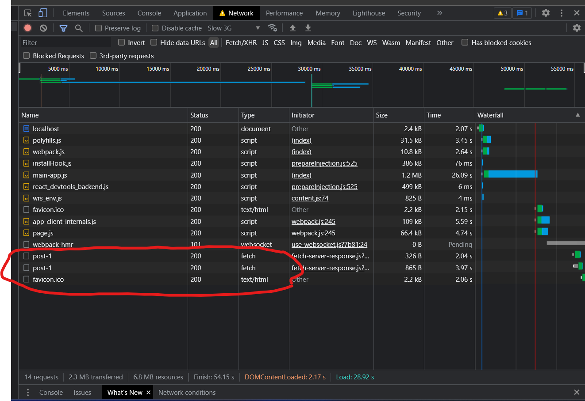

This is a [Next.js](https://nextjs.org/) project bootstrapped with [`create-next-app`](https://github.com/vercel/next.js/tree/canary/packages/create-next-app).

## Getting Started

First, run the development server:

```bash
npm run dev
# or
yarn dev
# or
pnpm dev
```

Open [http://localhost:3000](http://localhost:3000) with your browser to see the result.

# Route

### One Web page enter time , public pages completely we say

### Two sort route porcesss has

- static route
- dynamic route
  - catch all routes
  - optional catch all routes
- route grouping

# Link component

```jsx
<Link
  href={{
    pathname: "/about", // required
    query: {
      firstName: "Ayhan",
      lastName: "Dasyuvarlar",
    },
  }}
>
  About or Object
</Link>
```

<br/>

| Prop                  | Example                        | Type             | Required |
| --------------------- | ------------------------------ | ---------------- | -------- |
| <code>href </code>    | <code>href="/dashboard"</code> | String or Object | Yes      |
| <code>replace </code> | <code>replace={false}          | Boolean          | -        |
| <code>prefetch</code> | <code>prefetch={false} </code> | Boolean          | -        |

<br/>

# <code>replace</code>

### Defaults to false. When true, next/link will replace the current history state instead of adding a new URL into the <a href='https://developer.mozilla.org/en-US/docs/Web/API/History_API'>browser’s history </a>stack.

<br/>

# <code>Prefetch</code>

### Defaults to true. When true, next/link will prefetch the page (denoted by the href) in the background. This is useful for improving the performance of client-side navigations. Any <Link /> in the viewport (initially or through scroll) will be preloaded.

### Prefetch can be disabled by passing prefetch={false}. Prefetching is only enabled in production.


